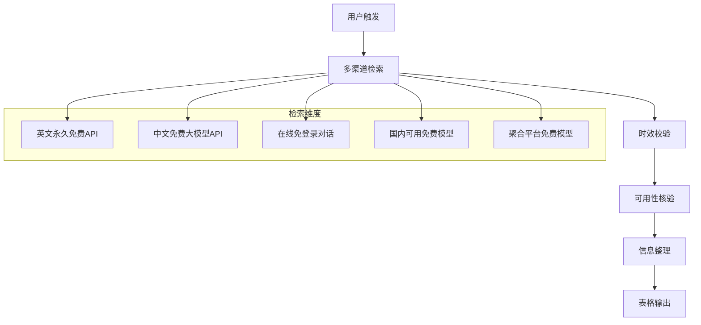

# 当日免费可用大模型检索 Skill

> 自动检索当日仍可免费使用的大语言模型，严格筛选永久免费或每日重置免费额度的模型，排除试用、限时、需付费、今日到期的资源。

[](LICENSE)
[]()
[]()

---

## 📋 功能概述

本Skill专为Agnes AI智能体设计，当用户询问免费AI模型推荐时自动触发，通过全网多渠道实时检索，严格筛选符合以下硬性标准的模型：

| 筛选维度 | 要求 |
|---------|------|
| **使用模式** | 永久免费 / 每日重置免费额度 |
| **时效要求** | 有效期 ≥ 今日，不今日到期 |
| **可用性** | 无需特殊资格、无地区锁、可直接调用 |
| **黑名单** | 排除试用、新用户专享、限时活动、隐性扣费 |

## 🚀 使用方法

### 方式一：直接调用
在聊天中输入：
```
$free-llm-daily-check
```

### 方式二：自然语言触发
直接描述需求即可自动匹配：
- "今天有哪些免费大模型可以用？"
- "推荐几个免费AI模型"
- "不用付费的AI聊天机器人"
- "免费大模型清单"

### 方式三：加载后手动执行
```
load_skill(name: "free-llm-daily-check")
```

## 📊 输出格式

以Markdown表格输出，按类别分组：

| 模型/平台名称 | 免费权益详情 | 使用入口 | 免费有效期 | 使用限制 |
|---|---|---|---|---|

**字段说明：**
- **模型/平台名称**：模型名或平台名
- **免费权益详情**：具体免费内容
- **使用入口**：官网URL或API接入方式
- **免费有效期**：永久免费 / 每日重置 / 具体截止日期
- **使用限制**：RPM、RPD、Token上限、注册要求等

## 🔍 执行流程



## 📁 项目结构

```
free-llm-daily-check/
├── SKILL.md          # Skill核心指令（Agnes AI专用）
├── README.md         # 本项目文档（你正在看的这个）
├── LICENSE           # MIT许可证
└── .gitignore        # Git忽略规则
```

## ⚠️ 注意事项

1. **政策变动**：免费额度政策可能随时调整，请以各平台官方最新说明为准
2. **数据隐私**：部分免费API可能使用用户数据进行模型训练，使用时请注意
3. **区域限制**：标注了"国内可直连"的资源无需代理即可使用
4. **注册要求**：部分服务需要邮箱/GitHub账号注册，但均不需要信用卡

## 🛡️ 过滤规则

以下类型资源**一律不收录**：

- ❌ 仅新用户注册赠送额度（额度用完即止）
- ❌ 需要信用卡验证的"免费"
- ❌ 当日/当月有效限时活动
- ❌ 额度耗尽后无法使用的模型
- ❌ 需要付费会员才能使用的模型
- ❌ 隐性扣费平台
- ❌ 试用截止资源

## 📝 更新日志

| 日期 | 版本 | 说明 |
|------|------|------|
| 2026-07-23 | v1.0.0 | 初始版本发布 |

## 📄 License

MIT License - 详见 [LICENSE](LICENSE) 文件

---

> 💡 **提示**：本Skill由 [Agnes Code](https://github.com/sapiensai) 开发和维护，基于Agnes AI智能体框架构建。
