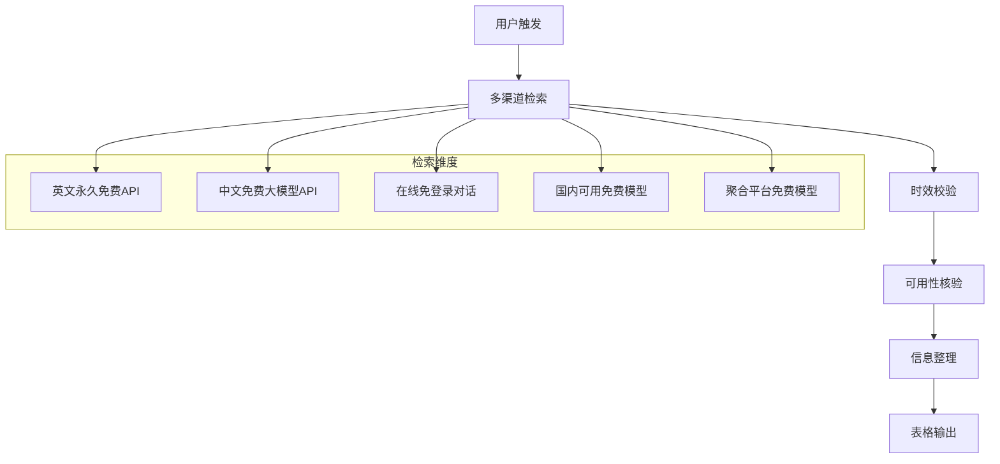

# 当日免费可用大模型检索 Skill

> 自动检索当日仍可免费使用的大语言模型，严格筛选永久免费或每日重置免费额度的模型，排除试用、限时、需付费、当日到期的资源。**设计为 agent 无关（agent-agnostic）模块，可被任意 AI 智能体解耦集成。**

[](LICENSE)
[]()
[]()

---

## 📋 功能概述

本 Skill 用于检索**指定日期**仍可免费使用的大语言模型，当用户询问免费 AI 模型推荐时触发，通过多渠道实时检索，严格筛选符合以下硬性标准的模型：

| 筛选维度 | 要求 |
|---------|------|
| **使用模式** | 永久免费 / 每日重置免费额度 |
| **时效要求** | 有效期 ≥ 指定日期（`as_of_date`，默认执行当日），不当日到期 |
| **可用性** | 无需特殊资格、无地区锁、可直接调用 |
| **黑名单** | 排除试用、新用户专享、限时活动、隐性扣费、仅限特定地区等 |

**设计原则（agent 无关 / 解耦）：**
- 不依赖任何调用方的会话上下文、环境变量或私有状态。
- 仅依赖一组**显式输入参数**和一个**调用方提供的联网检索能力**（通过 `tool_binding` 绑定）。
- 输入 / 输出均有明确契约，可被任意 agent 以程序化方式集成。

---

## 🚀 使用方法

### 方式一：自然语言触发（任意 agent 通用）
直接描述需求即可自动匹配：
- "今天有哪些免费大模型可以用？"
- "推荐几个免费 AI 模型"
- "不用付费的 AI 聊天机器人"
- "免费大模型清单"

### 方式二：带参数显式调用
```
free-llm-daily-check --as_of_date 2026-07-27 --region cn --categories api,chat,aggregator --output markdown --lang zh
```

### 方式三：Agnes 环境（历史用法，仍兼容）
```
$free-llm-daily-check
load_skill(name: "free-llm-daily-check")
```

---

## 📊 输出格式

按类别输出三张表（仅输出 `categories` 指定的类别），并附「证据来源」区块：

**API 类**
| 模型/平台名称 | 免费权益详情 | 使用入口 | 免费有效期 | 使用限制 | 证据来源 |
|---|---|---|---|---|---|

**在线对话类**
| 模型/平台名称 | 免费权益详情 | 使用入口 | 免费有效期 | 使用限制 | 证据来源 |
|---|---|---|---|---|---|

**聚合平台类**
| 模型/平台名称 | 免费权益详情 | 使用入口 | 免费有效期 | 使用限制 | 证据来源 |
|---|---|---|---|---|---|

> 设置 `output=json` 时返回对象数组（字段：`category, name, benefit, entry, validity, limits, evidence`），便于程序化消费。

---

## 🔍 执行流程



---

## 🔌 如何接入任意 Agent（tool_binding 示例）

本 Skill **不绑定任何具体工具实现**。它只声明需要两类能力，由调用方在 `tool_binding` 中把抽象能力映射到自己的真实工具。

### 1. 依赖能力签名
- `web_search(query: str, keyword_groups?: list[str], max_results?: int) -> list[{title, url, snippet}]`
- `web_fetch(url: str, prompt?: str) -> str`

### 2. tool_binding 模板（由调用方填写）
```
## tool_binding（由调用方填写）
web_search: <调用方实际提供的联网检索工具>
web_fetch:  <调用方实际提供的网页抓取工具>
```
Skill 执行步骤中以 `{{web_search}}` / `{{web_fetch}}` 指代上述绑定。

### 3. 各 agent 填写样例

**① WorkBuddy（通用 agent）**
```yaml
tool_binding:
  web_search: WebSearch      # 参数: query + query_keyword_groups(最多5组) + maxItems
  web_fetch:  WebFetch       # 参数: url + prompt
```
> 注：Skill 的 `keyword_groups` 对应 WebSearch 的 `query_keyword_groups`。

**② Agnes（历史环境，兼容）**
```yaml
tool_binding:
  web_search: web_search     # Agnes 内置联网检索
  web_fetch:  read_webpage   # Agnes 内置网页读取
```

**③ Python / LangChain agent（自实现绑定层）**
```python
# 调用方实现两个函数，供 skill 步骤中的 {{web_search}} / {{web_fetch}} 调用
def web_search(query: str, keyword_groups=None, max_results: int = 10):
    # 接入 SerpAPI / Tavily / Bing 等
    return [{"title": t, "url": u, "snippet": s} for t, u, s in ...]

def web_fetch(url: str, prompt: str = None):
    # 接入 BeautifulSoup / Playwright / Jina Reader 等
    return page_text
```

**④ Claude / Anthropic agent（tool-use）**
```json
{
  "tools": [
    {"name": "web_search", "input_schema": {"type": "object", "properties": {
      "query": {"type": "string"},
      "keyword_groups": {"type": "array", "items": {"type": "string"}},
      "max_results": {"type": "integer"}
    }, "required": ["query"]}},
    {"name": "web_fetch", "input_schema": {"type": "object", "properties": {
      "url": {"type": "string"}, "prompt": {"type": "string"}
    }, "required": ["url"]}}
  ]
}
```
> 在 tool-use 循环中，把 `web_search` / `web_fetch` 的调用路由到你的检索后端即可。

### 4. 完整集成检查清单
- [ ] 绑定 `tool_binding.web_search` 与 `tool_binding.web_fetch` 到真实工具
- [ ] 透传输入参数：`as_of_date` / `region` / `categories` / `output` / `lang`
- [ ] 读取输出：Markdown 三表（人读）或 JSON 数组（程序消费）
- [ ] 不向 Skill 注入任何会话上下文 / 环境变量（Skill 自行按契约运行）

---

## 📁 项目结构

```
free-llm-daily-check/
├── SKILL.md          # Skill 核心指令（agent 无关、可解耦集成）
├── README.md         # 本项目文档（你正在看的这个）
├── PUBLISH_GUIDE.md  # 仓库发布与 agent 接入指南
├── LICENSE           # MIT 许可证
├── package.json      # 项目元数据
└── .gitignore        # Git 忽略规则
```

## ⚠️ 注意事项

1. **政策变动**：免费额度政策可能随时调整，请以各平台官方最新说明为准
2. **数据隐私**：部分免费 API 可能使用用户数据进行模型训练，使用时请注意
3. **区域限制**：标注了「国内可直连」的资源无需代理即可使用（`region=cn` 时标注）
4. **注册要求**：部分服务需要邮箱/GitHub 账号注册，但均不需要信用卡
5. **解耦原则**：本 Skill 不依赖任何调用方上下文或环境变量，可被任意 agent 集成

## 🛡️ 过滤规则

以下类型资源**一律不收录**：

- ❌ 仅新用户注册赠送额度（额度用完即止）
- ❌ 需要信用卡验证的「免费」
- ❌ 当日/当月有效限时活动
- ❌ 额度耗尽后无法使用的模型
- ❌ 需要付费会员才能使用的模型
- ❌ 隐性扣费平台
- ❌ 仅限特定地区（如仅 US）
- ❌ 需企业邮箱/学生认证

## 📝 更新日志

| 日期 | 版本 | 说明 |
|------|------|------|
| 2026-07-27 | v1.1.0 | 重构为 agent 无关模块：动态 `as_of_date`、显式输入/输出契约、`tool_binding` 解耦工具、三分类输出、证据来源；新增「接入任意 Agent」指南 |
| 2026-07-23 | v1.0.0 | 初始版本发布（Agnes 专用） |

## 📄 License

MIT License - 详见 [LICENSE](LICENSE) 文件

---

> 💡 **提示**：本 Skill 最初由 [Agnes Code](https://github.com/sapiensai) 开发，现重构为可在任意 AI 智能体上解耦运行的通用模块。
